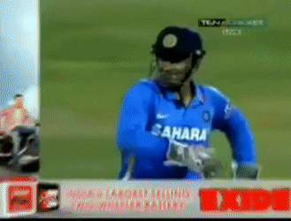

<!DOCTYPE html>
<html>
<head>
<title>Keep calm</title>
</head>
    <link rel="stylesheet" href=1.css>
    
<body >
    <h1 style="text-align:center;">MY INSPIRATION</h1>
    

       
    
    
        
    

<a href="https://www.deccanherald.com/sites/dh/files/styles/article_detail/public/article_images/2020/04/05/file75wl3lcdo6s323yga4s-1586078251.jpg?itok=SzBE8FcW"     title="Be careful"> click here to view my inspiration</a>
      
<button> hit </button>
<button type="submit"> submit</button>
<h3>ABOUT HIM</h3> 
<ul>
<li>Indian</li>
<li>Wicket keeper batsmen</li>
<li>Chennai</li>
<li>Thala</li>
</ul>

OK ok

<pre style="color:blueviolet; ;">
                   men will be men
why should only men have all the fun
</pre>

   

     
    

<h3> Skills </h3>

<ul>
<li> spontaineity</li>
<li> A good mentor</li>
<li> Always cool </li>

</ul>    
    
    

<button onclick="myFunction()"> just Try it</button>

    

 Do u think he will give a comeback to the international

    
<form>
   
    <input type="radio" id="yes" name="ra" value="yes">
    <label for="yes">YES</label> 
    <input type="radio" id="No" name="ra" value="No">
    <label for="No">NO</label> 
</form>

    
FAMILY

 

    
<a href= "two.html">Sakshi</a>

        
<a href="3.html">Ziva</a>

       

    

    

    
    

    
    

    

    

</body>
</html>
